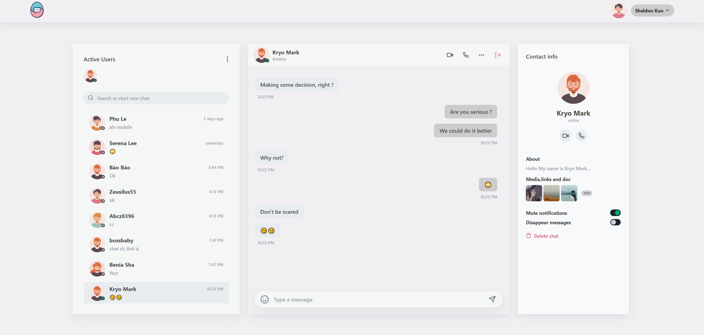

<div align="center">
  <a href="https://postwoman.io">
  </a>
  <br/>
  <br/>

  [](https://github.com/keysKuo/Llama3-sql-optimization.git) [](https://ezticket.io.vn) [](https://discord.gg/Z4ZxSRF6) [](https://pypi.python.org/pypi/ansicolortags/)


  </p>
  <p>
    <sub>Built with ✏️ by
      <a href="https://github.com/keysKuo">nkeysKuo</a> and
      <a href="https://github.com/keysKuo">NewAI teams</a>
    </sub>
  </p>
</div>

<h3 align="center"></h3>

<br/>

## EzChat

Welcome to EzChat, the ultimate solution for seamless and secure communication. Whether you're connecting with friends, family, or colleagues, EzChat provides a rich set of features designed to enhance your messaging experience.

<br/>

## Getting Started

After reading this section, please proceed to [**Installation**](#installation) and [**Configuration**](#configuration) below.
Read these instructions carefully or you may see errors due to
an invalid setup.

### Local Development


```bash
# For Frontend
git clone https://github.com/keysKuo/MERN-EzChat-SocketIO.git
cd frontend
cp .env.example .env
npm install
npm run dev

# For Backend
cp .env.example .env
npm install
npm run dev
```

Frontend: http://localhost:5173
Backend: http://localhost:2405

<br/>

### Using Docker Compose

```bash
docker-compose up --build -d
```

<br/>

### Built With

To run this project, make sure that your environment have all of these frameworks/libraries:

* [![React][React.js]][React-url]
* [![Vite][Vite]][Vite-url]
* [![TailwindCSS][TailwindCSS]][Tailwind-url]
* [![DaisyUI][DaisyUI]][DaisyUI-url]
* [![Node.js][Node.js]][Node-url]
* [![Express.js][Express.js]][Express-url]
* [![MongoDB][MongoDB]][MongoDB-url]


<!-- MARKDOWN LINKS & IMAGES -->
<!-- https://www.markdownguide.org/basic-syntax/#reference-style-links -->
[React.js]: https://img.shields.io/badge/React-20232A?style=for-the-badge&logo=react&logoColor=61DAFB
[React-url]: https://reactjs.org/
[ReactNative.js]: https://img.shields.io/badge/react_native-%2320232a.svg?style=for-the-badge&logo=react&logoColor=%2361DAFB
[ReactNative-url]: https://reactnative.dev
[Expo.js]: https://img.shields.io/badge/expo-1C1E24?style=for-the-badge&logo=expo&logoColor=#D04A37
[Expo-url]: https://expo.dev
[Vite]: https://img.shields.io/badge/vite-%23646CFF.svg?style=for-the-badge&logo=vite&logoColor=white
[Vite-url]: https://vitejs.dev/
[TailwindCSS]: https://img.shields.io/badge/Tailwind_CSS-38B2AC?style=for-the-badge&logo=tailwind-css&logoColor=white
[Tailwind-url]: https://tailwindcss.com
[Node.js]: https://img.shields.io/badge/Node.js-43853D?style=for-the-badge&logo=node.js&logoColor=white
[Node-url]: https://nodejs.org/
[Express.js]: https://img.shields.io/badge/Express.js-404D59?style=for-the-badge
[Express-url]: https://expressjs.com/
[MongoDB]: https://img.shields.io/badge/MongoDB-4EA94B?style=for-the-badge&logo=mongodb&logoColor=white
[MongoDB-url]: https://www.mongodb.com/
[DaisyUI]: https://img.shields.io/badge/daisyui-5A0EF8?style=for-the-badge&logo=daisyui&logoColor=white
[DaisyUI-url]: https://daisyui.com/
